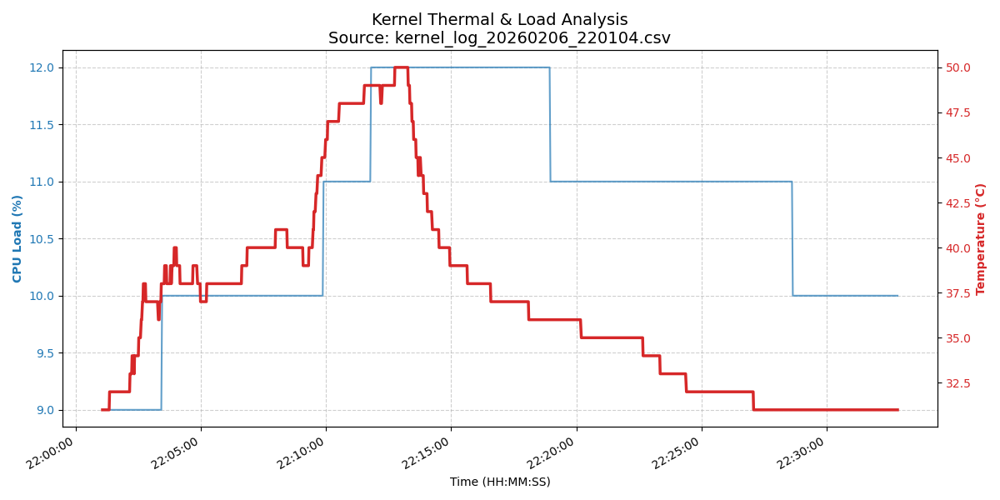

# 🐧 Android Kernel Telemetry Suite (Snapdragon 626 / Android 8)

A comprehensive monitoring and diagnostic toolset designed to interface directly with the **Linux Kernel (v3.18.71)** of a **Samsung Galaxy C7 Pro**. This project bypasses standard Android APIs to read raw hardware states directly from the kernel's virtual filesystems via ADB.

---

## 📑 Table of Contents
1. [Overview](#-overview)
2. [Hardware Architecture](#-hardware-architecture)
3. [Technical Implementation](#-technical-implementation)
4. [Methodology: The Stress Test](#-methodology-the-stress-test)
5. [Data Analysis & Insights](#-data-analysis--insights)
6. [Usage Guide](#-usage-guide)

---

## 🔍 Overview
This project provides a "bare-metal" look at how the Android OS manages hardware resources. By utilizing **ADB (Android Debug Bridge)**, we establish a low-level communication channel to pull telemetry from `/proc` and `/sys` nodes. This allows for real-time tracking of thermal throttling, CPU governor behavior, and power delivery performance without requiring root access.

## 📱 Hardware Architecture
* **Device:** Samsung Galaxy C7 Pro (SM-C7010)
* **SoC:** Qualcomm Snapdragon 626 (MSM8953 Pro)
* **CPU:** Octa-core 2.2 GHz Cortex-A53
* **Kernel:** Linux 3.18.71-14455749
* **OS:** Android 8.0.0 (Oreo)

## 🛠 Technical Deep Dive: ADB & Kernel Interface

This suite functions by establishing a low-level bridge to the Android Linux kernel. Below is the breakdown of how raw ADB commands are utilized to generate telemetry.

### 1. CPU Load Calculation (`/proc/stat`)
Instead of utilizing resource-heavy background processes, the suite calculates load using a differential jiffy analysis.
* **Command:** `adb shell cat /proc/stat | head -n 1`
* **Logic:** The script captures the delta between `Total Time` and `Idle Time` across two polling intervals to derive a precise usage percentage.

### 2. Frequency Scaling & Governors
The Snapdragon 626 utilizes "Big.LITTLE" scheduling. We monitor the clock speeds of both the efficiency and performance clusters.
* **Core 0 (Little):** `adb shell cat /sys/devices/system/cpu/cpu0/cpufreq/scaling_cur_freq`
* **Core 7 (Big):** `adb shell cat /sys/devices/system/cpu/cpu7/cpufreq/scaling_cur_freq`
* **Governor:** The system is monitored under the `interactive` governor, which ramps frequencies based on real-time task demand.

### 3. Thermal Telemetry (`/sys/class/thermal`)
Thermal data is pulled from the motherboard's physical thermistor.
* **Command:** `adb shell cat /sys/class/thermal/thermal_zone1/temp`
* **Observation:** Data points indicate a consistent thermal floor of ~31°C during idle states.

### 4. Power Delivery & Battery Health
To analyze battery health and current draw, we monitor the raw millivolts being pushed to the SoC.
* **Voltage:** `adb shell cat /sys/class/power_supply/battery/voltage_now`
* **Capacity:** `adb shell cat /sys/class/power_supply/battery/capacity`
---

## 🧪 Methodology: The Stress Test
The project employs a three-phase experimental methodology to generate structured telemetry logs for analysis.

### **Phase 1: Baseline**
* **State:** Device at idle with screen active.
* **Kernel Behavior:** Minimal interrupt requests (IRQs); frequency sits at the minimum step (e.g., 652 MHz or 1401 MHz depending on background tasks).
* **Goal:** Establish ambient temperature (~31°C) and baseline memory pressure.

### **Phase 2: Stress**
* **State:** High-computational load (e.g., 4K video recording or benchmark).
* **Kernel Behavior:** The **Interactive Governor** detects task demand, ramping frequencies to the maximum (2.2 GHz).
* **Goal:** Force the SoC toward its thermal trip point. In this SoC, we observe a steady climb toward **50°C**.

### **Phase 3: Recovery**
* **State:** Immediate cessation of load; return to home screen.
* **Kernel Behavior:** CPU load drops instantly, but **Thermal Lag** is observed.
* **Goal:** Measure the passive cooling efficiency of the device's thermal dissipation design.

---

## 📊 Data Visualization & Analysis
The following graph represents a successful stress test execution:



### **Key Insights from the Graph:**
1. **Thermal Inertia:** While CPU Load is a "step function" (rising and falling instantly), the Temperature is a "curve." Heat builds up and dissipates slowly due to the physical limitations of passive cooling.
2. **Voltage Sag:** During the Stress Phase, a corresponding drop in battery voltage (mV) is typically recorded as the internal resistance of the battery reacts to the high current draw.
3. **RAM Stability:** Memory usage remains relatively flat (~92%), indicating the Android kernel's preference for cached background processes over free memory.

---

## 🚀 Usage Guide

### Setup
1. Enable **USB Debugging** on the C7 Pro.
2. Install dependencies on Ubuntu: 
   ```bash
   sudo apt install android-platform-tools python3-pandas python3-matplotlib
   ```
###Execution
1. Live Monitor: Run ./monitor_c7.sh for a real-time hardware dashboard.
2. Data Logger: Run ./c7_logger.sh to capture telemetry to a CSV file.
3. Analytics: Run python3 plot_kernel.py to generate the neat analysis plot.

